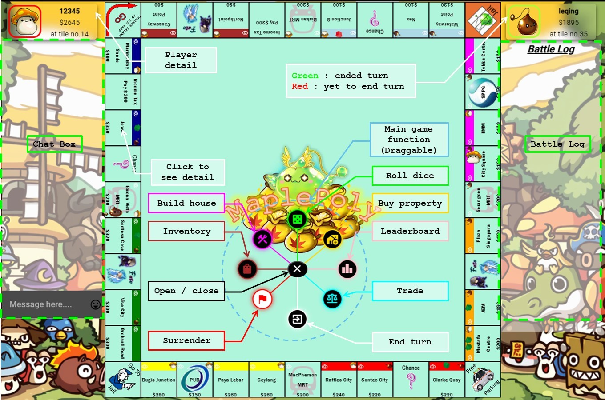
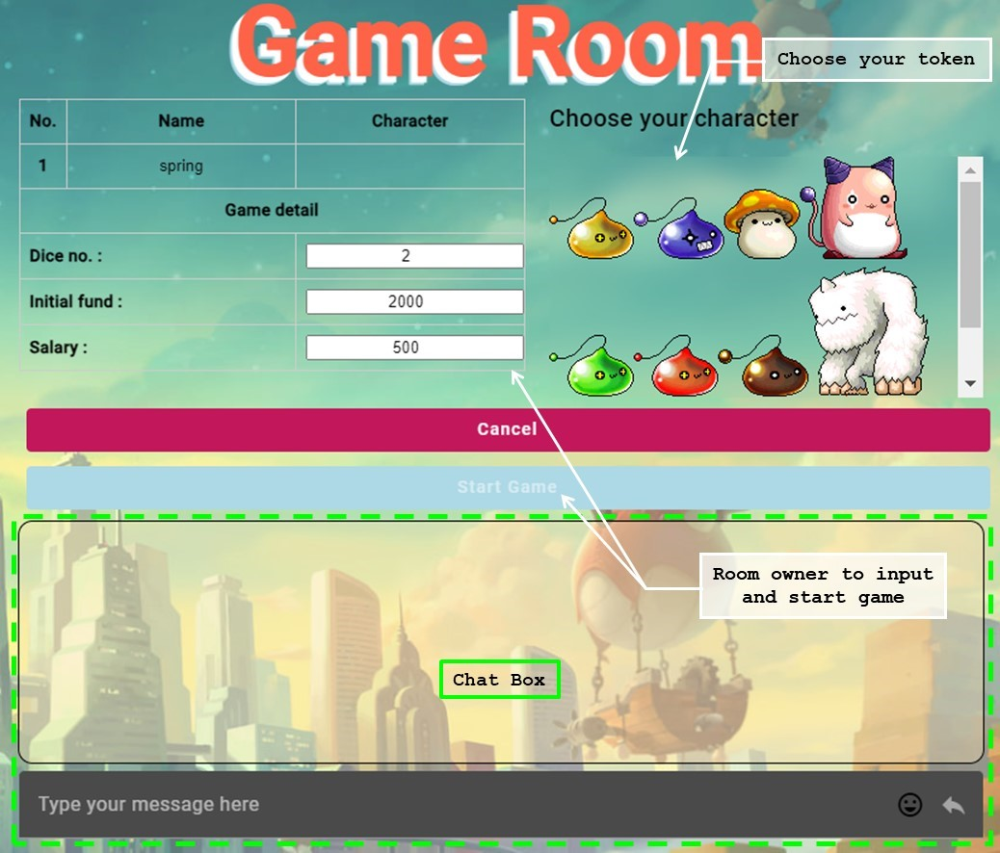
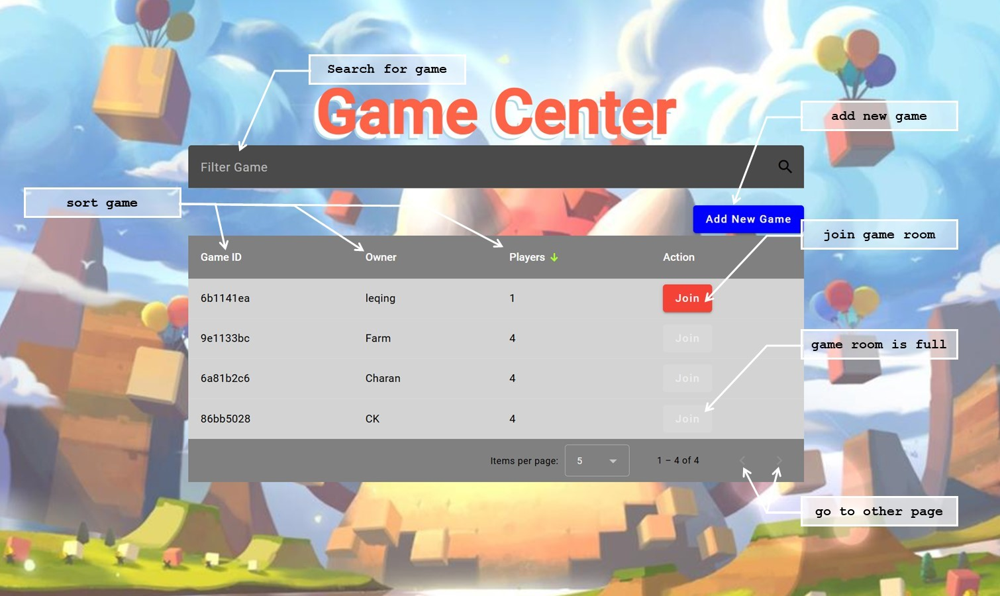

# MAPLEPOLY
## Railway link
https://kind-rejoicing-production.up.railway.app/

## Summary
A multiplayer Monopoly game built with Angular as frontend and Java as backend. 
It allows players to chat and send giphys in real-time while in the game or game room. 
Unlike traditional turn-based Monopoly, MaplePoly enables all players to make moves simultaneously in the same turn, speeding up gameplay. 
The game supports fast-paced actions such as immediate property purchases and hotel construction. 
However, players who can't pay rent or taxes will go bankrupt, even if they own multiple properties that can be sold.

## Table of Contents
- [Folder Structure](#folder-structure)
- [Set up Guide](#setup-guide)
- [Technologies](#technologies)
- [Media Credits](#media-credits)
- [Preview](#preview)

### Folder Structure
The workspace contains two folders, where:
- `frontend` : frontend file by Angular 17
- `backend` : backend file by Java 21 and data file for Mongo and MySQL

### Setup Guide
# frontend
1. `npm i` : to install the angular dependecy
2. change the related key to your own key in `frontend\src\app\environment.ts`
    - stripe site key
    - google recaptcha site key
3. change the `frontend\proxy.config.json` for CORS setting
4. `ng serve` : to start application

# backend
In `backend\src\main\resources\application.properties` :
1. change the relative path for MySQL and Mongo 
2. change the frontend domain `allow.origin` for websocket
4. change the stripe secret key, giphy key
5. `mvn clean spring-boot:run` : to start backend

# database
1. import `characters.json`, `fate.json`, `properties.json` in `backend` to mongo 
    ```
    mongoimport -h localhost:27017 -d monopoly -c properties --type json fate.json
    mongoimport -h localhost:27017 -d monopoly -c properties --type json properties.json
    mongoimport -h localhost:27017 -d monopoly -c characters --type json --jsonArray characters.json   
    ```
2. run `userinfo.sql` and `gameroom.sql` in backend im MySQL

### Technologies
1. JWT with HTTPonly cookie for security (https://www.geeksforgeeks.org/spring-boot-3-0-jwt-authentication-with-spring-security-using-mysql-database/)
2. WebSocket with TextWebSocketHandler for realtime update for players activities in Game Room and in Game
3. Stripe for donation (using test key) (https://www.npmjs.com/package/ngx-stripe)
4. Angular materials for frontend UI (https://material.angular.io/guide/getting-started)
5. NgRx store for game state management (https://ngrx.io/guide/store/install)
6. Google recaptcha for bot detection (https://www.npmjs.com/package/ng-recaptcha)
7. Chart.js for leaderboard (https://www.npmjs.com/package/chart.js?activeTab=readme)
8. Sprite animation for game tokens (https://www.youtube.com/watch?v=CY0HE277IBM&ab_channel=Frankslaboratory)
9. PWA (https://www.npmjs.com/package/@angular/pwa)
10. Service worker https://www.npmjs.com/package/@angular/service-worker

### Media Credits
- Media used is related to MapleStory and should not be used for commercial purposes.
- https://maplestory.io/

### Preview


